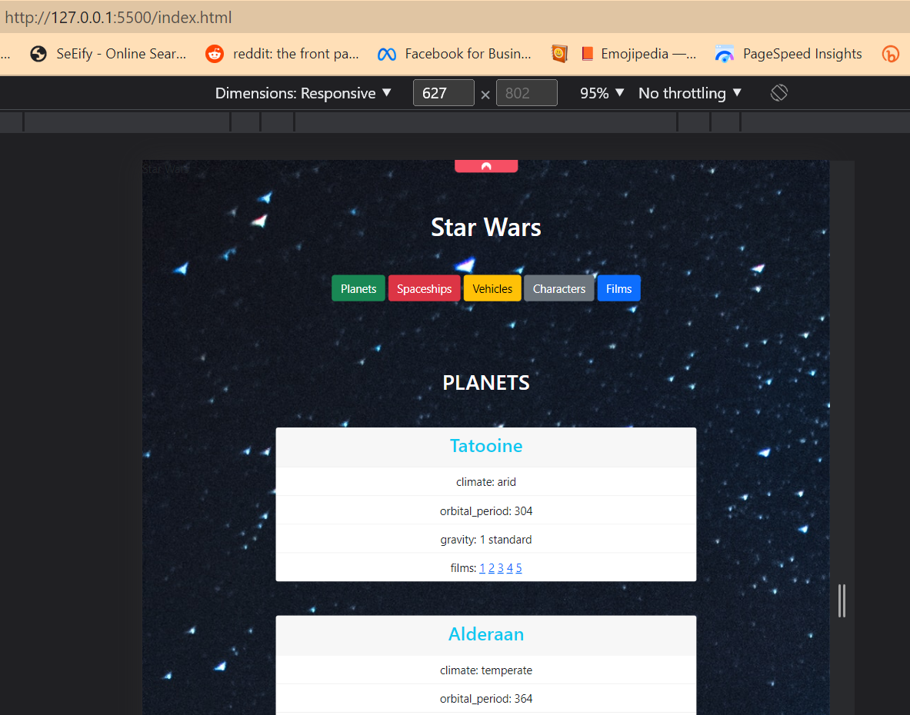

# Pre-work for advanced class - Code the Dream

To use this project:

* In bash use git clone https://github.com/alextorreswa/prework_advanced_class.git to download the project files.

* Then, enter to the project folder and access it with visual code.

* To run, right click on the index.html file and select open with live server.

Thank you,

Alex Torres

  